# YMA Tools: Folder Icon Changer 📂🎨

> **"Customizing Windows folders shouldn't be boring."**  
> An open-source, cyber-themed automation tool that integrates into your Context Menu. It handles the downloading, converting, and applying of high-quality icons to any folder on your system.

---

## 🚀 Installation & Setup

### 1. The Setup Manager

Run the `YMAIconChanger.ps1` script as Administrator. You will be greeted by the **Cyber Interface Setup Manager**.

From here, you can manage the entire lifecycle of the tool. To begin, type **`1`** and press Enter.

  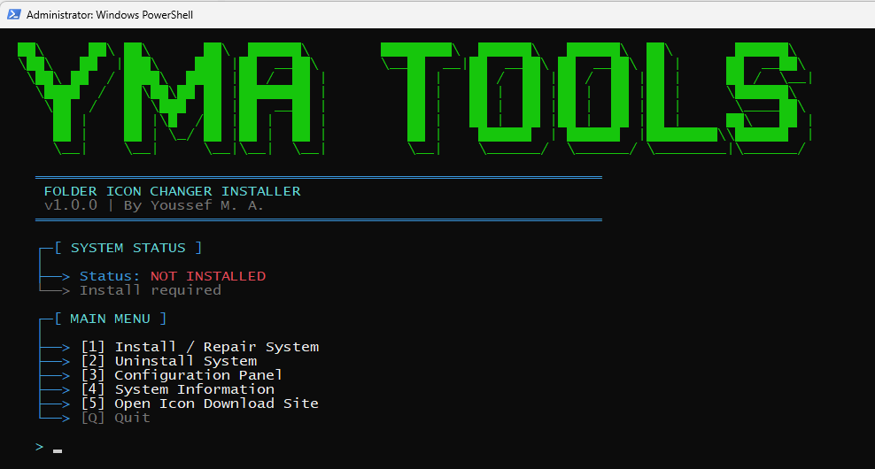

### 2. Automated Installation

The script will automatically:

1.  Create the necessary system directories.
2.  Deploy the logic engine.
3.  Download the custom icon for the context menu.
4.  **Inject Registry Keys** to add the tool to your Windows Right-Click menu.

  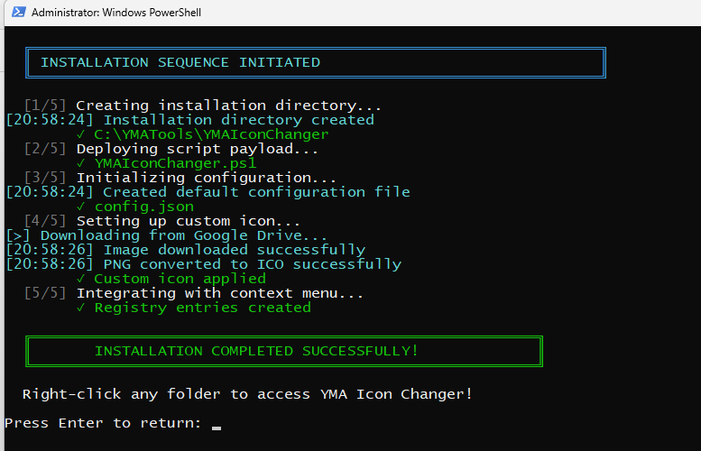
  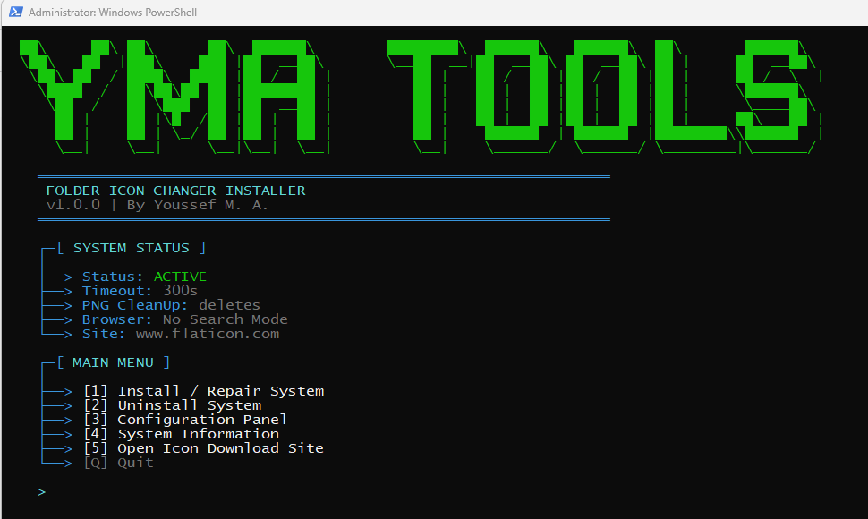

---

## 🎮 How to Use

### Step 1: Right-Click any Folder

Once installed, the tool lives in your context menu. Simply right-click on the folder you want to customize (or inside the empty space of a folder) and select:
**`Change Folder Icon (YMA)`**

  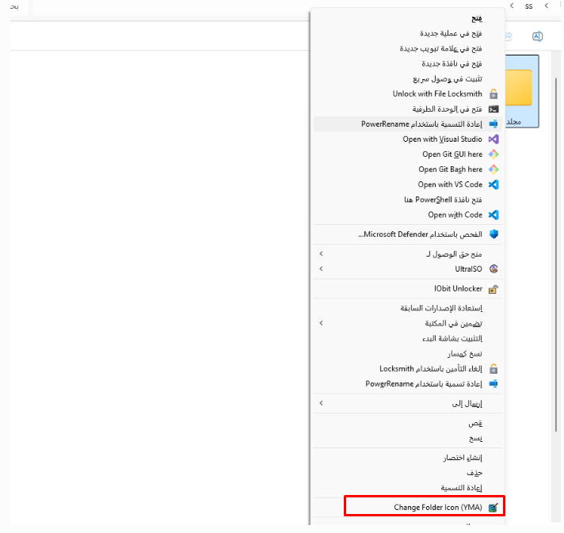

### Step 2: Enter Keyword & Automate

A terminal window will open with the "Icon Engine".

1.  Enter a **Keyword** (e.g., "Car", "Work", "Anime").
2.  The tool will automatically launch your browser to an icon search engine.
3.  **Download any PNG file**. The tool monitors your Downloads folder in real-time.

  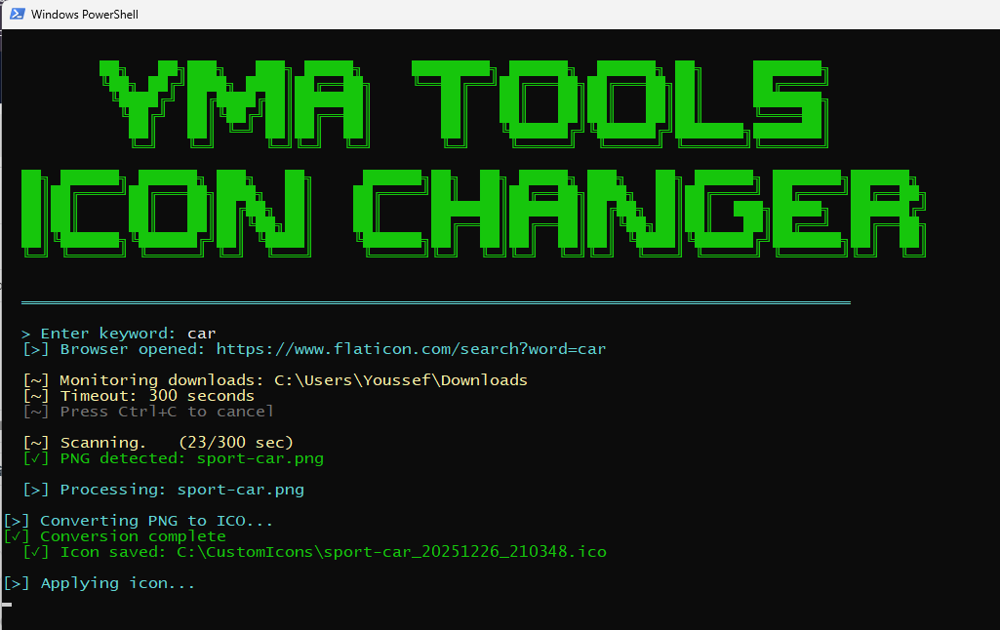
    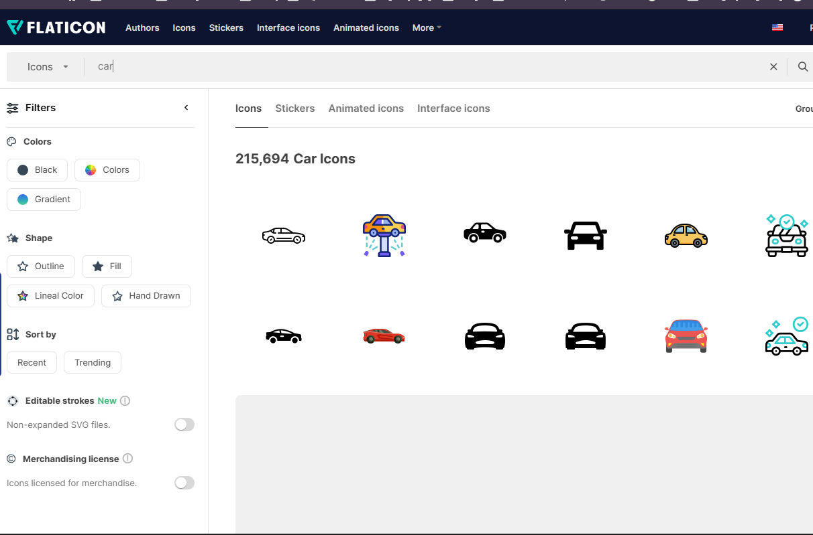

### Step 3: Auto-Conversion & Result

As soon as the download finishes, the tool:

1.  Detects the new PNG.
2.  Converts it to a high-quality `.ico`.
3.  Applies it to the folder.
4.  Forces Windows Explorer to refresh.

**The Result:**

  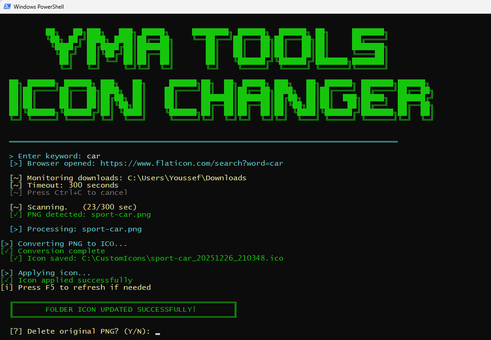
  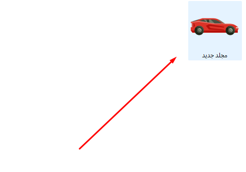

---

## ⚙️ Advanced Configuration

Want to change how the tool works? Relaunch the installer and select **`[3] Configuration Panel`**.

  

You can customize various settings, including Browser Mode and Monitor Timeout.

### 🌐 Browser Behavior (Option 6)

You can toggle between two modes in the config panel:

-   **🔍 Search Mode (Default):**
    The tool prompts you to enter a **Keyword** in the terminal. It then opens the browser directly to the search results for that keyword.

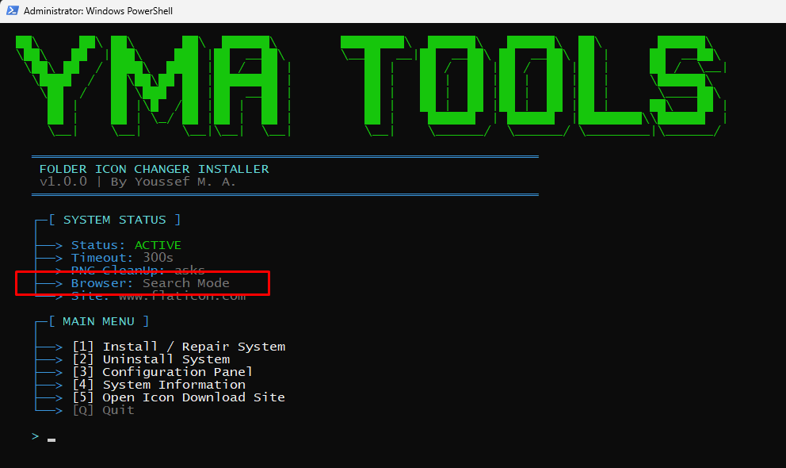

-   **🚀 No Search Mode (Direct Open):**
    The tool skips the keyword prompt and opens your chosen Icon Site immediately. This is useful if you prefer to browse categories manually without typing a search term first.

  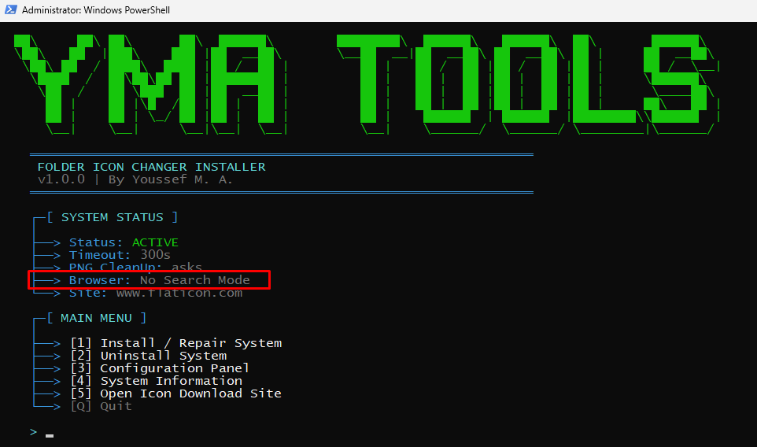

### ⏱️ Monitor Timeout (Option 4)

This setting controls how long the "Icon Engine" stays active waiting for you to download a file.

-   **Default:** 300 Seconds (5 Minutes).
-   **Usage:** If you like to take your time browsing for the perfect icon, increase this value. The terminal shows a visual countdown.

  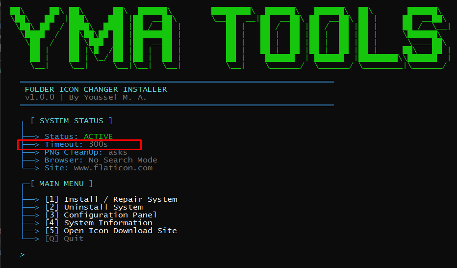
    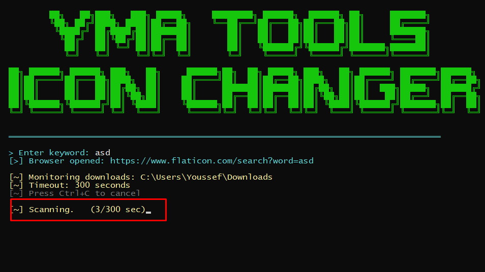

### Other Settings:

-   **Icon Storage:** Where to save the converted icons.
-   **Downloads Path:** Which folder to watch for new images.
-   **Cleanup Behavior:** Auto-delete the downloaded PNGs or keep them?
-   **Download Site:** Switch between Flaticon, Icons8, or custom URLs.

### ⚠️ Important:

**Don't Forget to Save Changes!**
After modifying any settings, ensure you select **`[S] SAVE & EXIT`**.

  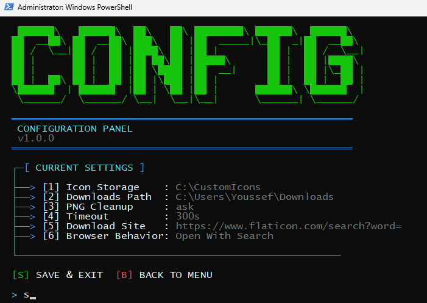
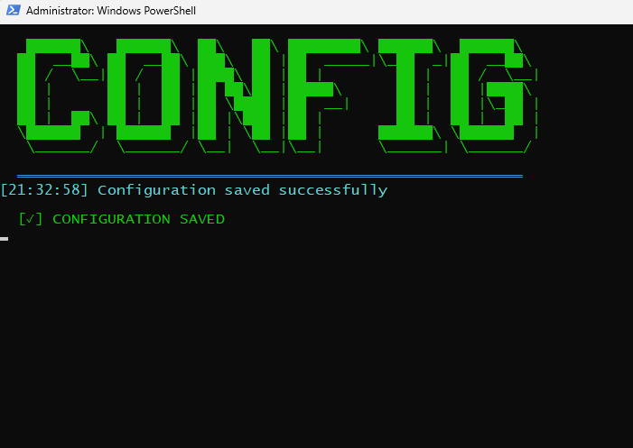

---

## ℹ️ System Information

Select **`[4] System Information`** from the main menu to view installation paths, file sizes, registry status, and version info.

  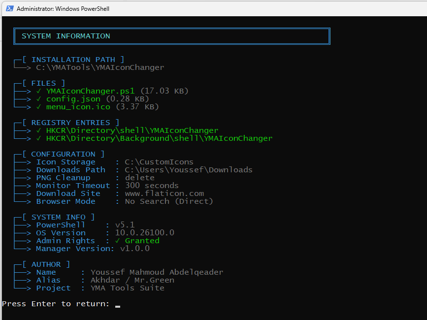

---

## 🛠️ Technical Details

-   **Language:** PowerShell 5.1+
-   **Dependencies:** .NET `System.Drawing` (Loaded dynamically).
-   **Registry Paths:**
    -   `HKEY_CLASSES_ROOT\Directory\shell\YMAIconChanger`
    -   `HKEY_CLASSES_ROOT\Directory\Background\shell\YMAIconChanger`
-   **Permissions:** Requires Administrator rights for Registry editing and `desktop.ini` attribute modification.

---

## 🤝 Contributing

This is an open-source project! Contributions are welcome.

1.  Fork the Project
2.  Create your Feature Branch (`git checkout -b feature/AmazingFeature`)
3.  Commit your Changes (`git commit -m 'Add some AmazingFeature'`)
4.  Push to the Branch (`git push origin feature/AmazingFeature`)
5.  Open a Pull Request

---

## 👨‍💻 Author

**Youssef Mahmoud Abdelqeader**  
_(Alias: Akhdar / Mr. Green)_

---

## 📜 License

Distributed under the MIT License. See `LICENSE` for more information.